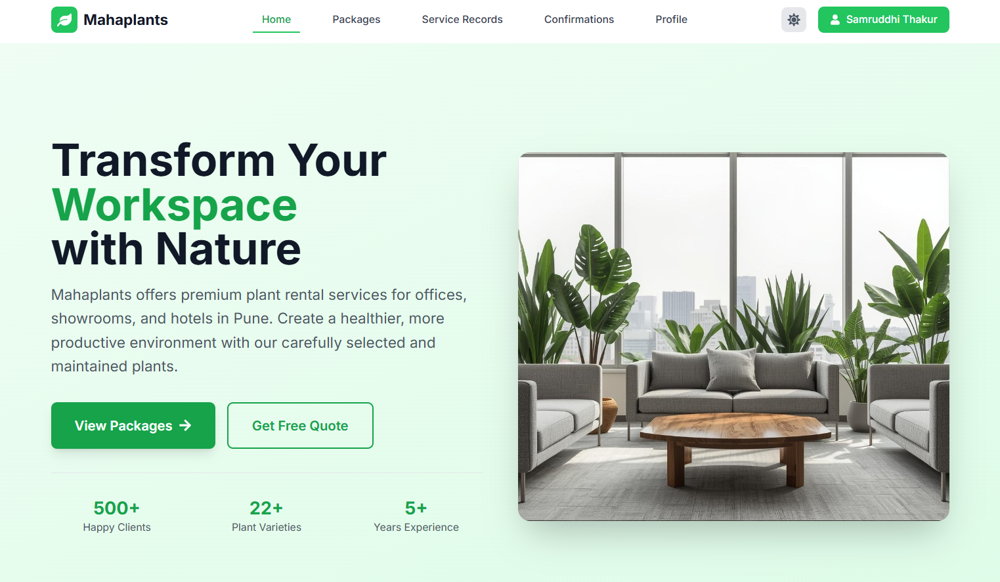
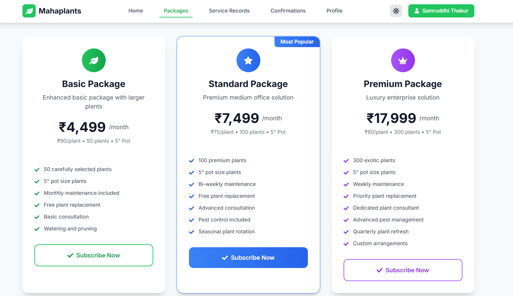
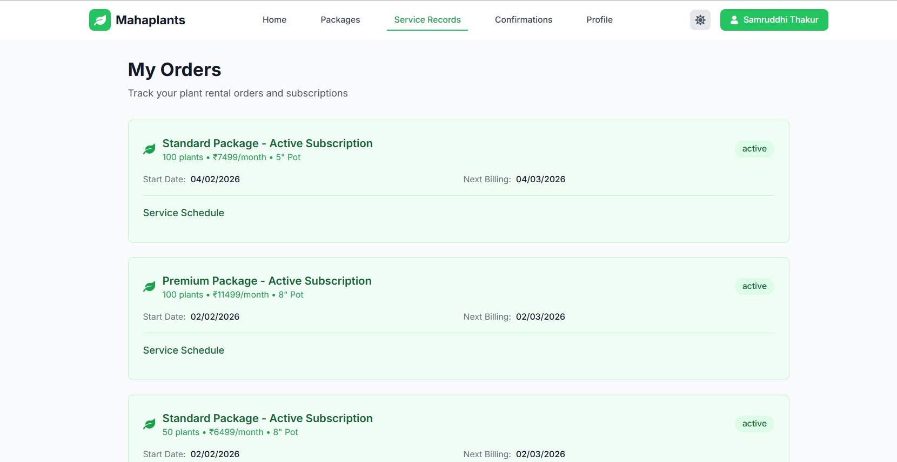
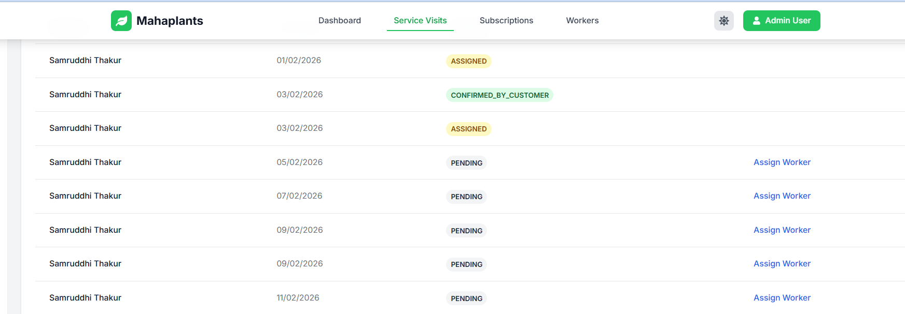
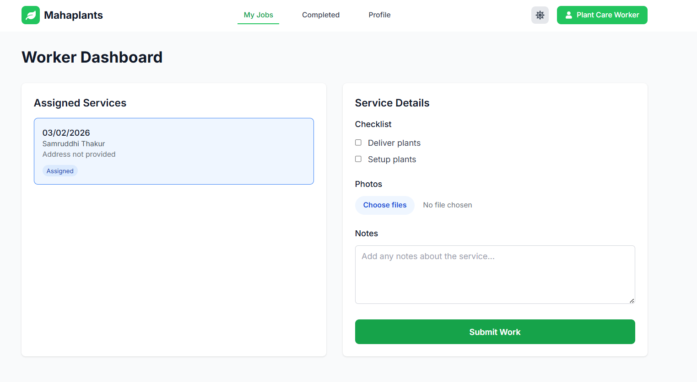
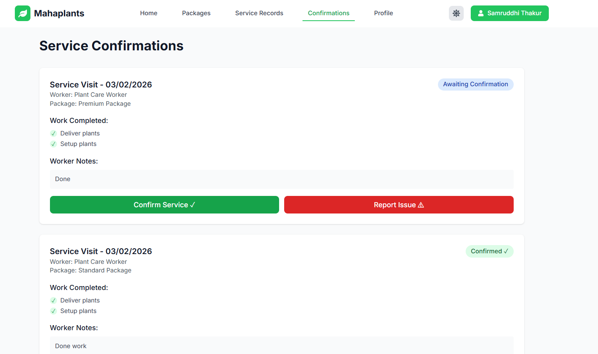
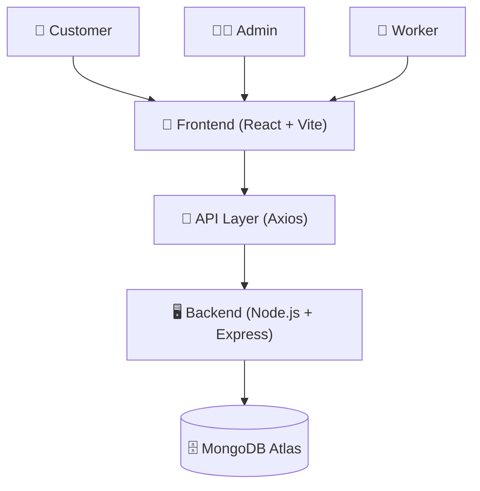
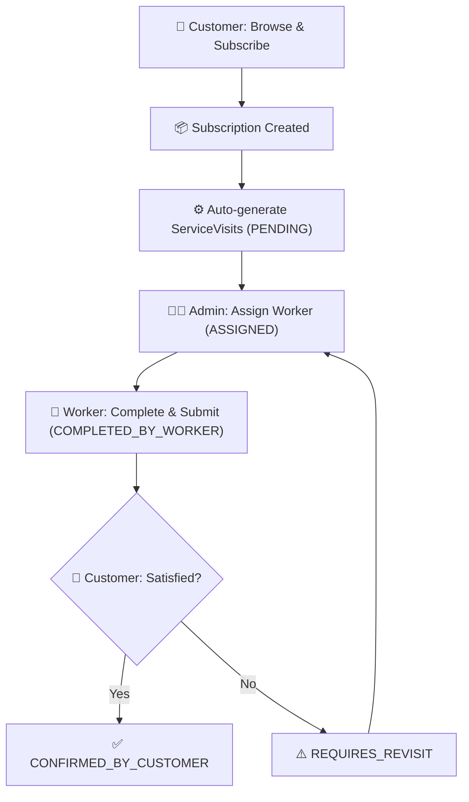
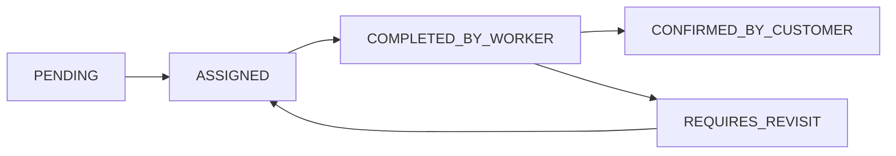

# 🌱 Mahaplants – Complete Plant Care Service Platform




A full-stack **plant rental & maintenance management system** for offices, showrooms, and commercial spaces.  
Businesses subscribe to plant packages and receive **automated maintenance services** with full lifecycle tracking.

> 🚀 Built as a **production-style system** with real business workflows — not a basic CRUD project.

---

## 🚀 Live Application (Local)

- **Frontend:** http://localhost:5173  
- **Backend:** http://localhost:5001  
- **Admin Panel:** http://localhost:5173/admin/services  

---

### 🔐 Secure Authentication


Role-based authentication using JWT with protected routes for Customer, Admin, and Worker access.

### 📦 Package-Based Subscription Flow



Customers subscribe to tiered plant rental packages (Basic / Standard / Premium).  
Each subscription automatically triggers maintenance service creation and lifecycle tracking in the backend.


### 📋 Customer Subscription & Service Tracking



Customers can view active subscriptions, billing cycles, and upcoming service schedules in real time.

### 👨💼 Admin – Service Visit Management



Admins manage all service visits generated from subscriptions, assign workers, and track real-time service status across the complete lifecycle.

### 👷 Worker – Service Execution & Submission



Assigned workers complete service checklists, upload proof images, and submit service updates, triggering the next step in the service lifecycle.

### 👤 Customer – Service Confirmation & Feedback



Customers review completed services, verify checklist and notes, and either confirm completion or request a revisit, ensuring full accountability in the service lifecycle.

---

## ✨ Key Features

### 🎯 Smart Subscription System
- Package-based plant rentals (Basic / Standard / Premium)
- Auto-generation of maintenance **ServiceVisits**
- System-driven scheduling (no manual work)

### 👥 Multi-Role Platform
- **Customer:** Subscribe, track services, confirm work
- **Admin:** View all services, assign workers
- **Worker:** Complete assigned tasks, upload photos

### 🔄 End-to-End Service Lifecycle

```
Subscription → Auto Service Creation → Worker Assignment
→ Service Completion → Customer Confirmation / Revisit
```

---

## 🏗️ System Architecture



## 🔄 Service Workflow



## 📊 Status Flow



---

## 📁 Project Structure

### Frontend (React + Vite)
```
client/
├── src/
│   ├── pages/
│   │   ├── Packages.jsx
│   │   ├── user/MySubscriptions.jsx
│   │   ├── admin/ServiceManagement.jsx
│   │   └── worker/WorkerDashboard.jsx
│   ├── context/
│   │   ├── AuthContext.jsx
│   │   ├── ThemeContext.jsx
│   │   └── CartContext.jsx
│   └── utils/api.js
└── package.json
```

### Backend (Node.js + Express)
```
server/
├── server.js
├── models/
│   ├── User.js
│   ├── Subscription.js
│   └── Service.js
├── routes/
│   ├── auth.js
│   ├── subscriptions.js
│   └── services.js
├── middleware/
│   └── auth.js
└── .env
```

---

## 🛠️ Tech Stack

### Frontend
- React 19 + Vite
- Tailwind CSS
- Framer Motion
- React Router
- Context API

### Backend
- Node.js + Express.js
- MongoDB + Mongoose
- JWT Authentication
- bcryptjs
- Helmet + Rate Limiting

---

## 📦 Installation & Setup

### 1️⃣ Clone Repository
```bash
git clone <repository-url>
cd mahaplants-project
```

### 2️⃣ Backend Setup
```bash
cd server
npm install
```

Create `.env` file:
```env
PORT=5001
MONGODB_URI=your_mongodb_uri
JWT_SECRET=your_secret
NODE_ENV=development
CORS_ORIGIN=http://localhost:5173
```

Start backend:
```bash
npm run dev
```

### 3️⃣ Frontend Setup
```bash
cd client
npm install
npm run dev
```

---

## 👤 User Roles & Permissions

| Role | Access |
|------|--------|
| **Customer** | Subscribe, view services, confirm work |
| **Admin** | View all services, assign workers |
| **Worker** | Complete assigned services |

### Admin / Worker Setup
1. Register normally
2. Update `role` field in MongoDB (`user` → `admin` / `worker`)

---

## 🎮 How to Test the Flow

1. **Register/Login** as Customer
2. **Subscribe** to a package
3. **View** My Subscriptions
4. **Login as Admin** → assign worker
5. **Login as Worker** → complete service
6. **Confirm service** as Customer

---

## 🚀 Deployment

### Frontend
```bash
npm run build
# Deploy dist/ folder on Vercel / Netlify
```

### Backend
```bash
node server.js
# Deploy on Railway / Render
```

---

## 📄 License

This project is licensed under the MIT License.

## 👨💻 Author

**Mahaplants Team**  
Plant rental and maintenance experts in Pune

---

**🌿 "Bringing nature to your workspace, one plant at a time"**
